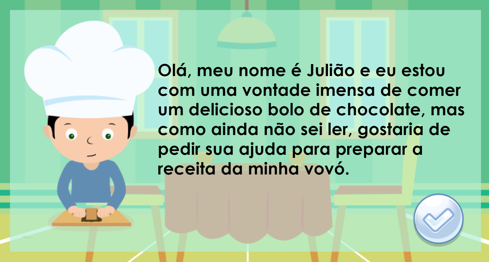

## Heyyy, seja bem-vindo(a) a minha página! 

## Navegando por está página você encontrará os meus jogos digitais, artes realistas, participações em eventos e projetos.

### Sou aluno do 3º ano do curso técnico integrado em desenvolvimento de jogos digitais, amante de artes visuais e de pesquisa científica.  
### Desenvolvedor de Jogos Digitais.
### Pesquisador Multidisciplinar em Psicologia, Neurologia e Artes Visuais.  
### Artista Realista com foco em Reprodução Gráfica Facial, Corporal e de Objetos Físicos.

### Contatos:  

*  E-mail: wisematr@gmail.com

## Portfólio  

### Games

# [Parkour Junino](https://felipecastroifrn.github.io/ParkourJunino/) 

"Parkour Junino" propõe uma aventura por um ambiente com características dos festejos de São João.

 

Equipe: Felipe Castro.

***

# [Cake Boss](https://emanuellicarine.github.io/CakeBoss/)

"Cake Boss" é um jogo simples que busca fazer receitas de cozinha.
Primeira tentativa de jogo utilizando física para jogos.

***

# [Pokemons vs Humanos](https://bixcoito.github.io/Pokemon/)

"Pokemons vs Humanos" busca uma divertida releitura do jogo Plants vs Zombies.

 

Equipe: Emanuelle Carine e João Pedro.

## Projetos em eventos:
## 2015
> I SECITEX, IFRN campus Santa Cruz, com o projeto Cup Song, na modalidade apresentação cultural.  

## 2016
> SECITEX(2016), IFRN campus Parnamirim, dando início para a abertura do evento com a presentação do Cup Song. 

## 2017 
> I EXPOTEC – IFRN/CAMPUS SÃO PAULO DO POTENGI, com o projeto USO DE SUPLEMENTOS NUTRICIONAIS POR JOVENS PRATICANTES DE
ATIVIDADES FÍSICAS NO MUNICÍPIO DE CEARÁ-MIRIM: UMA PROPOSTA DE INTERVENÇÃO.
>
> FENECIT - PE, como finalista com o projeto GAMETERAPIA.
>
> V EXPOTEC APODI, como expositor na modalidade poster com projeto de pesquisa JOGOS DIGITAIS COMO FONTE DE CONHECIMENTO DA CULTURA BUDISTA: EM FOCO O NIRVANA.
>
> MOSTRATEC - RS, como finalista credenciada pela FENECIT.
>
> MOCITECZN (2017), como expositora na modalidade poster GAMETERAPIA.
>
> SECITEX(2017), IFRN campus caicó, com o projeto USO DE SUPLEMENTOS NUTRICIONAIS POR JOVENS PRATICANTES
DE ATIVIDADES FÍSICAS NO MUNICÍPIO DE CEARÁ-MIRIM: UMA
PROPOSTA DE INTERVENÇÃO, modalidade comunicação-oral.
>
> 
>
>   

## Projetos:
> 
  
 >   
 >  
 >   
 >  
 > 
      
 ## Galeria de Arte
 
