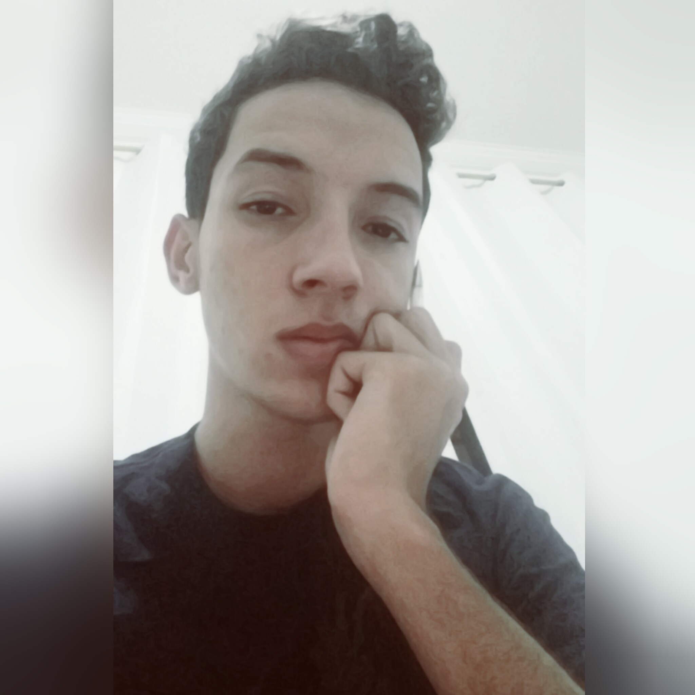

## Heyyy, seja bem-vindo(a) a minha página!

## Navegando por está página você encontrará os meus jogos digitais, artes realistas, participações em eventos e projetos.

### Sou aluno do 3º ano do curso técnico integrado em desenvolvimento de jogos digitais, amante de artes visuais e de pesquisa científica.  
### Desenvolvedor de Jogos Digitais.
### Pesquisador Multidisciplinar em Psicologia, Neurologia e Artes Visuais.  
### Artista Realista com foco em Reprodução Gráfica Facial, Corporal e de Objetos Físicos.

# Portfólio  

## Games

# [Parkour Junino](https://felipecastroifrn.github.io/ParkourJunino/) 

"Parkour Junino" propõe uma aventura por um ambiente com características dos festejos de São João.

 

Equipe: Felipe Castro.

***

# [Cake Boss](https://emanuellicarine.github.io/CakeBoss/)

"Cake Boss" é um jogo simples que busca fazer receitas de cozinha.
Primeira tentativa de jogo utilizando física para jogos.

***

# [Pokemons vs Humanos](https://bixcoito.github.io/Pokemon/)

"Pokemons vs Humanos" busca uma divertida releitura do jogo Plants vs Zombies.

 

Equipe: Emanuelle Carine e João Pedro.

## Projetos em eventos:
## 2015
> I SECITEX, IFRN campus Santa Cruz, com o projeto Cup Song, na modalidade apresentação cultural.  

## 2016
> SECITEX, IFRN campus Parnamirim, dando início para a abertura do evento com a presentação do Cup Song. 

## 2017 
> I EXPOTEC – IFRN/CAMPUS SÃO PAULO DO POTENGI, com o projeto USO DE SUPLEMENTOS NUTRICIONAIS POR JOVENS PRATICANTES DE
ATIVIDADES FÍSICAS NO MUNICÍPIO DE CEARÁ-MIRIM: UMA PROPOSTA DE INTERVENÇÃO.
>
> FENECIT - PE, como finalista com o projeto GAMETERAPIA.
>
> V EXPOTEC APODI, como expositor na modalidade poster com projeto de pesquisa JOGOS DIGITAIS COMO FONTE DE CONHECIMENTO DA CULTURA BUDISTA: EM FOCO O NIRVANA.
>
> MOSTRATEC - RS, como finalista credenciada pela FENECIT.
>
> MOCITECZN, como expositora na modalidade poster GAMETERAPIA.
>
> SECITEX, IFRN campus caicó, com o projeto USO DE SUPLEMENTOS NUTRICIONAIS POR JOVENS PRATICANTES
DE ATIVIDADES FÍSICAS NO MUNICÍPIO DE CEARÁ-MIRIM: UMA
PROPOSTA DE INTERVENÇÃO, modalidade comunicação-oral.

## Eventos externos:

> I SEMANA DA MATEMÁTICA (I SEMAT), campus São Paulo Potengi (2015).
>
> II SEMANA DA MATEMÁTICA (II SEMAT), campus São Paulo Potengi (2016).
>
> I CAMPEONATO DE TORRE DE HANOI, participante em todas as modalidades: 4 discos, 5 discos, 6 discos e às cegas (2016).
>
> III SEMANA DA MATEMÁTICA (II SEMAT), campus São Paulo Potengi (2017).
>
> I Seminário de Tecnologia da Informação e Comunicação (I SETIC) do IFRN/SGA (2017).

## Projetos:
> Projeto de Extensão Contínuo: Formação de professores da Escola Municipal Alberto Nicácio do Município de Ceará Mirim/RN: Uma perspectiva interdisciplinar - (2015).

> GAMETERAPIA: UMA FORMA DE UNIR JOGOS DIGITAIS A REABILITAÇÃO DE PACIENTES ACOMETIDOS PELO ACIDENTE VASCULAR ENCEFÁLICO (AVE) - (2017).

> ESTUDO DE CASO: A GAMETERAPIA COMO UMA FERRAMENTA AUXILIAR NA REABILITAÇÃO DE IDOSOS COM A NEUROFUNCIONALIDADE COMPROMETIDAPELO ACIENTE VASCULAR ENCEFÁLICO (AVE) - (2017/2018).

> 
## Premiações
> Primeiro lugar na categoria ciências da saúde, com o projeto GAMETERAPIA: UMA FORMA DE UNIR JOGOS DIGITAIS A REABILITAÇÃO DE PACIENTES ACOMETIDOS PELO ACIDENTE VASCULAR ENCEFÁLICO (AVE) (FENECIT - PE, 2017).

> Credenciamento do projeto GAMETERAPIA: UMA FORMA DE UNIR JOGOS DIGITAIS A REABILITAÇÃO DE PACIENTES ACOMETIDOS PELO ACIDENTE VASCULAR ENCEFÁLICO (AVE) para a 32ª edição da mostratec, 2017 (Projeto credenciado na FENECIT - PE, 2017).

> Credenciamento para a MOCICA 2018, no Ceará (MOCITEC - ZN, 2017).
      
 ## Galeria de Arte Realista e Ilustração
 ## Em andamento com Grafite
 

## Grafite: comparações com a foto real
 
 
***

## Grafite e Canetas Esferográficas

## Só Grafite

## Só Canetas Esferográficas

## Tinta Acrílica

***

## Digitais

***

### Contatos:  

* E-mail: wisematr@gmail.com
* Facebook: Matheus Ricardo - https://www.facebook.com/matheusricardocontact?ref=br_rs
* Instagram: matheusricardo.at - https://www.instagram.com/matheusricardo.at/?hl=pt-br
* DeviantArt: https://matheusricardoart.deviantart.com
* ArtStation: https://www.artstation.com/matric
